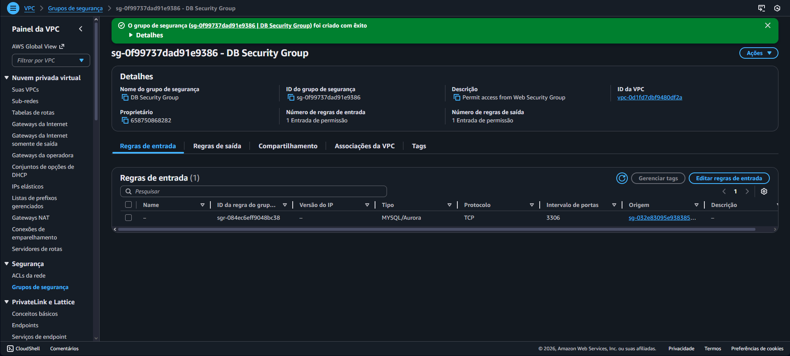
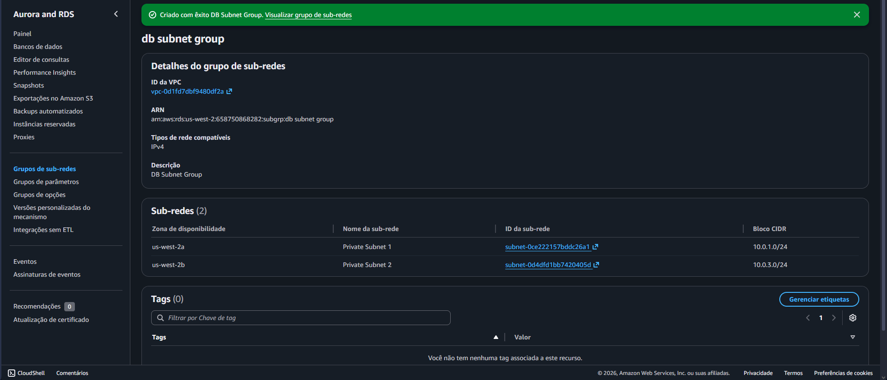
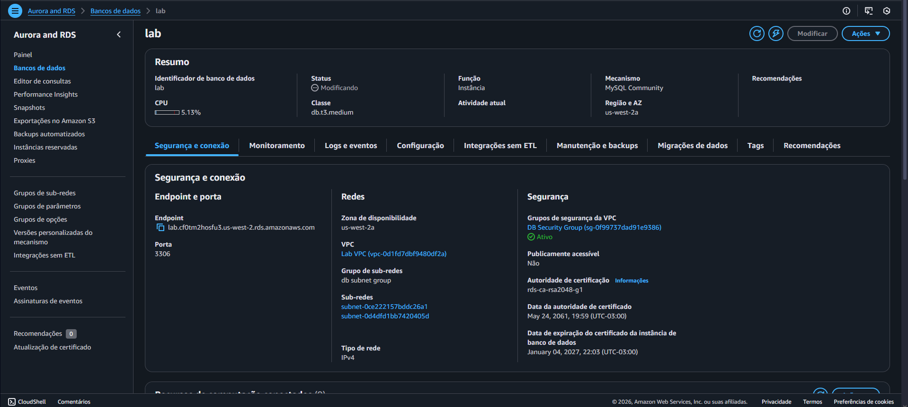
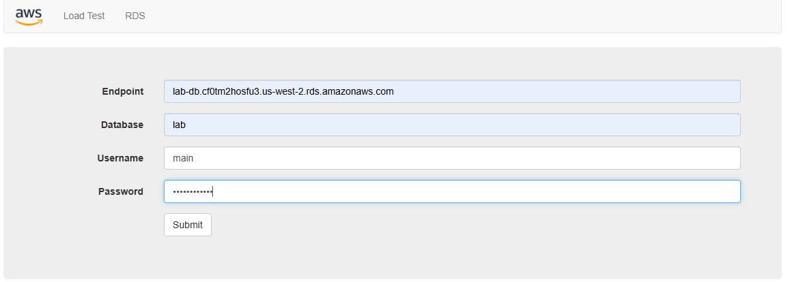
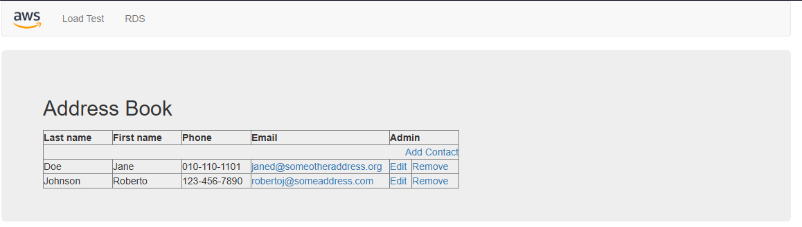

# ☁️ Lab – Amazon RDS: Servidor de Banco de Dados e Integração com Aplicação

  
  
  

## 📘 Visão Geral

Este laboratório teve como objetivo reforçar o uso de um **banco de dados relacional gerenciado** na AWS por meio do **Amazon Relational Database Service (Amazon RDS)**.  

A atividade consistiu em criar uma instância de banco de dados **MySQL com alta disponibilidade (Multi-AZ)**, configurá-la dentro de uma **VPC**, permitir a comunicação segura com um **servidor web** e interagir com o banco de dados por meio de uma **aplicação web**.

---

## 🎯 Objetivos do Lab

Ao final deste laboratório, fui capaz de:

- Executar uma instância do **Amazon RDS** com **alta disponibilidade**
- Configurar o banco de dados para permitir conexões apenas do servidor web
- Interagir com o banco de dados por meio de um **aplicativo web**

---

## ⚙️ O que foi feito neste Lab

1. 🔐 **Criação do Grupo de Segurança do Banco de Dados**
   - Criei um **Security Group** exclusivo para o banco de dados.
   - Configurei uma regra permitindo tráfego **MySQL (porta 3306)** somente a partir do **Security Group do servidor web**, garantindo acesso restrito e seguro.

   

2. 🌐 **Criação do Grupo de Sub-redes do Banco de Dados**
   - Criei um **DB Subnet Group** associado à **Lab VPC**.
   - Selecionei **duas sub-redes privadas**, cada uma em uma **Availability Zone diferente**, atendendo aos requisitos de alta disponibilidade do RDS.

   

3. 🛢️ **Criação da Instância Amazon RDS (Multi-AZ)**
   - Criei uma instância do **Amazon RDS** utilizando o engine **MySQL**.
   - Configurei a instância como **Multi-AZ**, garantindo redundância entre zonas de disponibilidade.
   - Associei o banco ao **DB Subnet Group** e ao **Security Group do banco de dados**.
   - Após a criação, copiei o **endpoint do RDS**, necessário para a conexão da aplicação.

   

4. 🖥️ **Integração com o Servidor Web**
   - Acessei o servidor web utilizando o **IP público da instância EC2**.
   - Configurei a aplicação web informando o **endpoint do RDS**, nome do banco, usuário e senha.
   - A aplicação conseguiu se conectar corretamente ao banco de dados.

   

5. 🌍 **Interação com o Banco de Dados**
   - Utilizei a aplicação web para **criar, editar e remover registros**.
   - Os dados foram armazenados no banco RDS e **replicados automaticamente** para a instância secundária em outra Availability Zone.

   

6. 🧹 **Encerramento do Laboratório**
   - Finalizei o laboratório utilizando a opção **End Lab**, encerrando automaticamente todos os recursos criados.

---

## 💡 Conceitos Aprendidos

- Funcionamento do **Amazon RDS** como serviço de banco de dados gerenciado
- Importância da **alta disponibilidade (Multi-AZ)** em bancos de dados
- Uso de **sub-redes privadas** para isolar bancos de dados
- Controle de acesso entre serviços usando **Security Groups**
- Integração segura entre **EC2 e RDS** dentro de uma VPC

---

## 🖥️ Resultado Final

Ao final do laboratório, foi implementada com sucesso uma arquitetura contendo:

- Banco de dados **Amazon RDS MySQL** com alta disponibilidade
- Comunicação segura entre servidor web e banco de dados
- Aplicação web funcional, realizando operações no banco de dados

✅ A solução atendeu ao cenário proposto, simulando uma arquitetura básica utilizada em ambientes corporativos.

---

## 🧭 Tecnologias Utilizadas

- **Amazon RDS**
- **Amazon EC2**
- **Amazon VPC**
- **Security Groups**
- **AWS Management Console**

---

## 🏁 Conclusão

Este laboratório consolidou a compreensão sobre o uso de **bancos de dados relacionais gerenciados na AWS**, destacando os benefícios de **segurança, disponibilidade e simplicidade operacional** oferecidos pelo Amazon RDS.  
A experiência reforçou a integração entre **infraestrutura, banco de dados e aplicação**, base fundamental para arquiteturas modernas em nuvem. ☁️🚀
