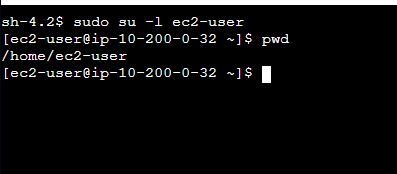
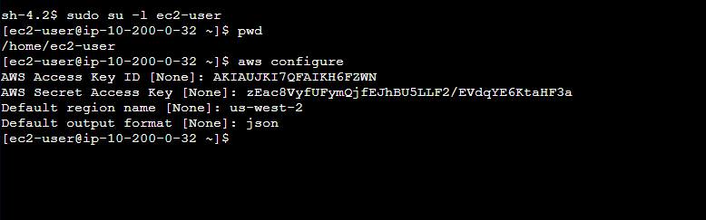
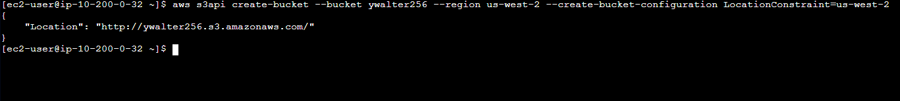
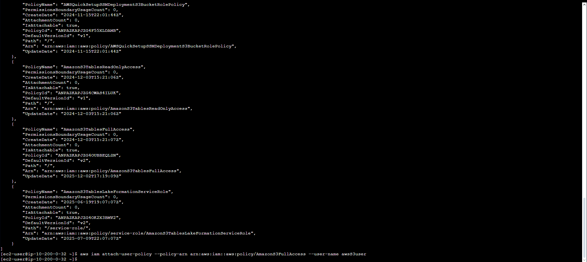
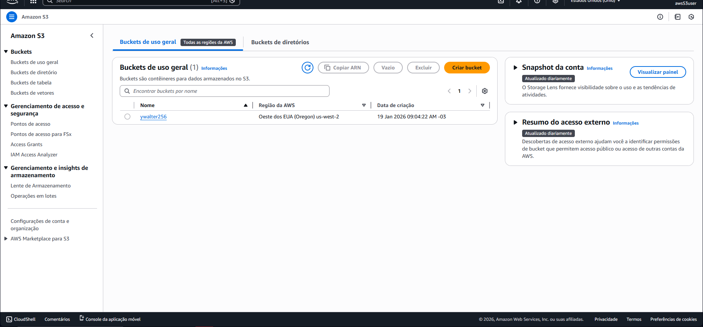
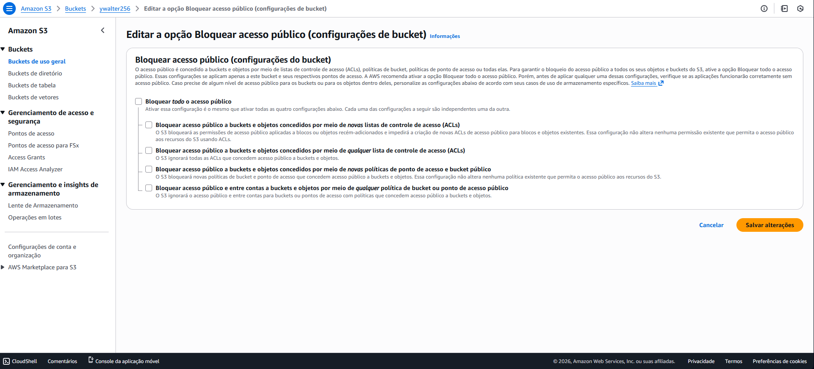
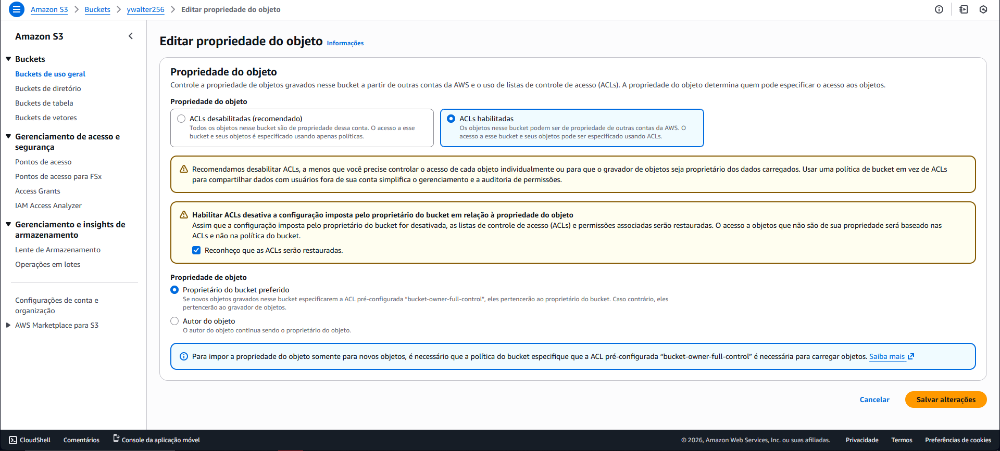
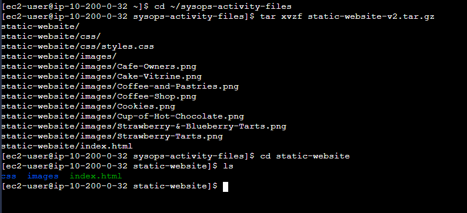
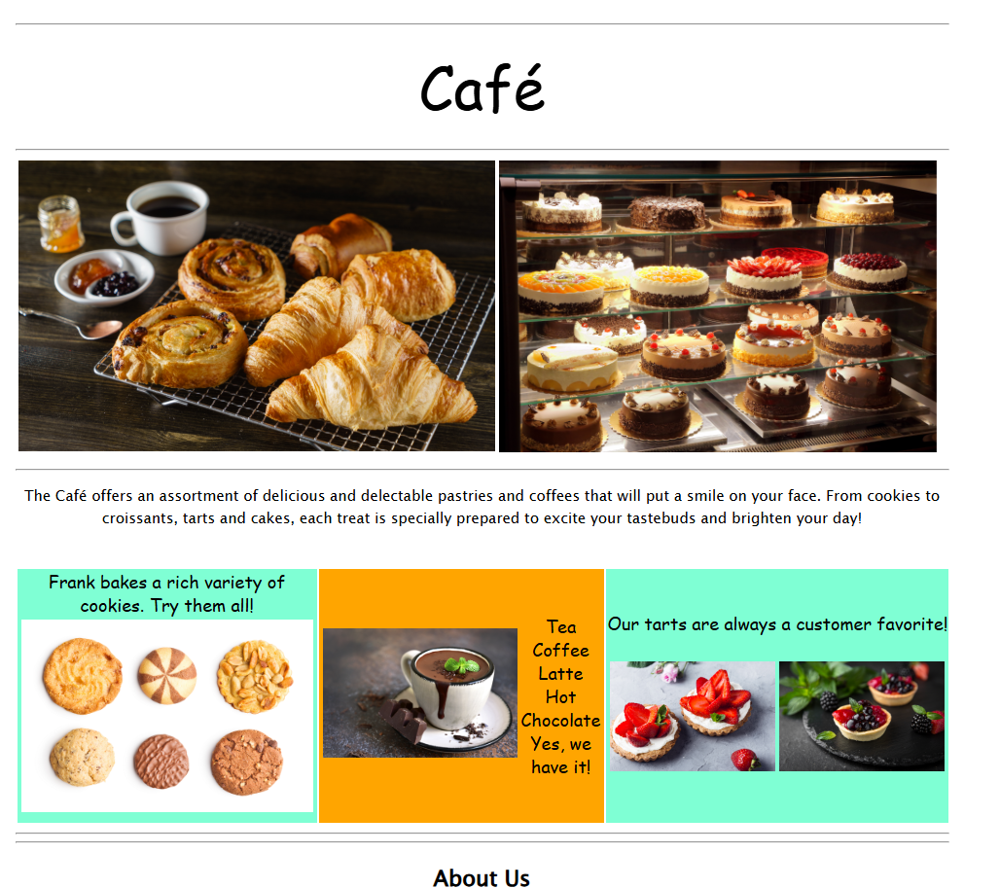
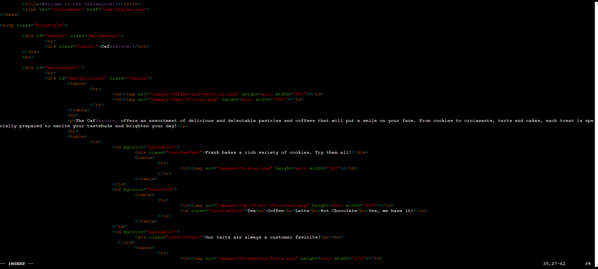

# 🌐 Lab – Hospedagem de Site Estático no Amazon S3 com AWS CLI

## 📘 Visão Geral

Neste laboratório, o objetivo foi **implantar um site estático no Amazon S3** utilizando a **AWS Command Line Interface (AWS CLI)**, além de configurar permissões de acesso e automatizar atualizações do site por meio de scripts.

O lab reforça o uso do S3 como solução de **hospedagem de sites estáticos**, integrando conceitos de **IAM**, **AWS CLI** e **automação básica**.

---

## 🎯 Objetivos do Laboratório

Ao final do laboratório, foi possível:

- Executar comandos da AWS CLI para IAM e Amazon S3  
- Criar e configurar um bucket S3  
- Hospedar um site estático no Amazon S3  
- Automatizar atualizações do site usando scripts  

---

## ⚙️ O que foi feito neste Lab

1. 🔐 **Acesso à Instância EC2 via Session Manager**
   - Conectei-me a uma instância **Amazon Linux EC2** usando o **Session Manager**.
   - Não foi necessário acesso via SSH ou gerenciamento de chaves.

   

2. ⚙️ **Configuração da AWS CLI**
   - Configurei a AWS CLI com credenciais de acesso.
   - Defini região padrão e formato de saída JSON.

   

3. ⚙️ **Criação do Bucket Amazon S3**
   - Criei um bucket S3 utilizando comandos da AWS CLI.
   - O bucket foi criado em uma região específica e com nome exclusivo.

   

4. 👤 **Criação de Usuário IAM para Acesso ao S3**
   - Criei um usuário IAM dedicado para acesso ao Amazon S3.
   - Associei uma política gerenciada que concede **acesso total ao S3**.
   - Validei permissões por meio do Console AWS.

   
   

5. 🔓 **Ajuste de Permissões do Bucket**
   - Desabilitei o bloqueio de acesso público.
   - Configurei ACLs para permitir leitura pública dos arquivos do site.
   - Preparei o bucket para hospedagem de site estático.

   
   

6. 📂 **Upload dos Arquivos do Site**
   - Extraí os arquivos do site estático localmente.
   - Utilizei a AWS CLI para copiar os arquivos para o bucket S3.
   - Configurei o documento de índice (`index.html`).

   

7. 🌍 **Publicação do Site Estático**
   - Ativei a hospedagem de site estático no bucket.
   - Acessei o site usando o **endpoint público do S3**.
   - Validei o funcionamento do site no navegador.

   

8. 🔁 **Automação de Atualizações com Script**
   - Criei um script em Bash para facilitar a atualização do site estático.
   - O script utiliza a AWS CLI para copiar os arquivos locais para o bucket S3.
   - Após alterações no HTML, o site pôde ser atualizado rapidamente com um único comando.

   
   
   

---

## 🧠 Conceitos Aprendidos

- Hospedagem de sites estáticos no Amazon S3
- Gerenciamento de permissões com IAM
- Uso prático da AWS CLI
- Controle de acesso público em buckets
- Automação básica de uploads com script Bash

---

## 🖥️ Resultado Final

Ao final do laboratório:

- O site estático estava hospedado e acessível publicamente via Amazon S3
- As permissões do bucket estavam corretamente configuradas
- O processo de atualização do site foi automatizado com script
- O uso da AWS CLI foi consolidado como alternativa ao Console AWS

---

## 🧰 Tecnologias Utilizadas

- Amazon S3  
- Amazon EC2  
- AWS CLI  
- AWS IAM  
- AWS Systems Manager (Session Manager)  
- Bash  
- AWS Management Console  

---

## 🏁 Conclusão

Este laboratório demonstrou como o **Amazon S3** pode ser utilizado de forma simples e eficiente para hospedagem de sites estáticos, além de reforçar o uso da **AWS CLI** e automação como parte do fluxo operacional em ambientes de nuvem.
