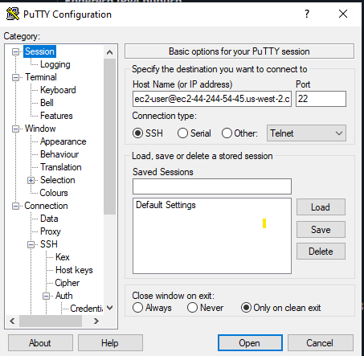
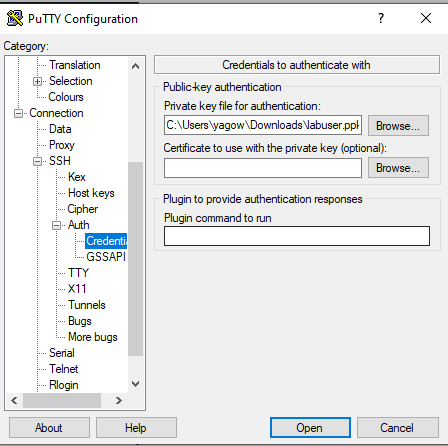
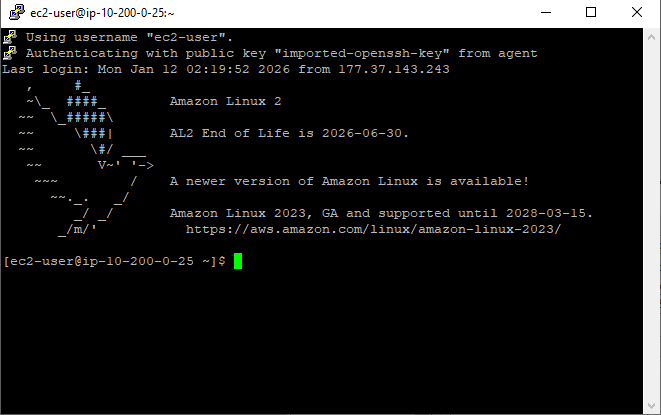
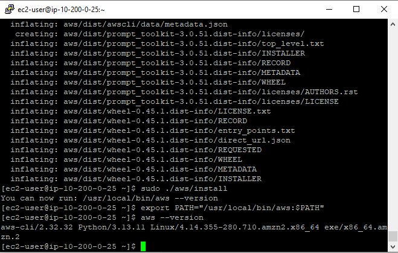
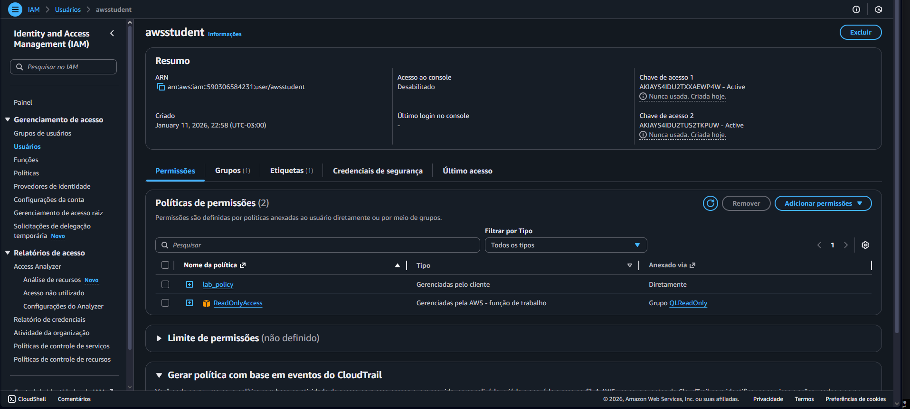
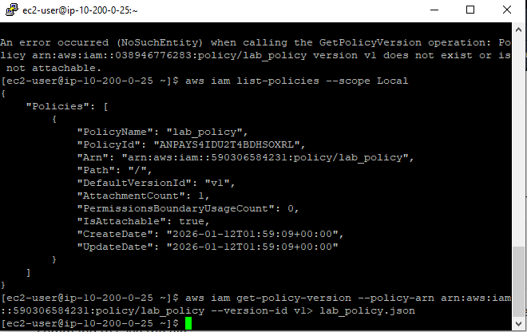

# 🖥️ Lab – AWS CLI e IAM

## 📘 Visão Geral

Neste laboratório, o objetivo foi **instalar e configurar a AWS Command Line Interface (AWS CLI)** em uma instância **EC2 com Red Hat Linux** e utilizá-la para **interagir com o AWS Identity and Access Management (IAM)**.

O lab mostrou, na prática, como acessar e gerenciar recursos da AWS **via linha de comando**, sem depender exclusivamente do Console de Gerenciamento.

---

## 🎯 Objetivos do Laboratório

Ao final do laboratório, foi possível:

- Instalar e configurar a **AWS CLI**
- Conectar a AWS CLI a uma conta AWS usando **Access Keys**
- Acessar e consultar recursos do **IAM** via CLI
- Comparar o uso do **Console AWS vs Linha de Comando**

---

## ⚙️ O que foi feito neste Lab

1. 🔐 **Conexão SSH com a Instância EC2**
   - Conectei-me a uma instância **EC2 Red Hat Linux** usando **SSH**.
   - Utilizei autenticação por **par de chaves**, garantindo acesso seguro à instância.

   
   
   

2. 📦 **Instalação da AWS CLI**
   - Baixei o instalador oficial da AWS CLI.
   - Realizei a instalação manual na instância Red Hat.
   - Verifiquei a instalação e a versão instalada.

   

3. 🔍 **Análise das Configurações do IAM**
   - Acessei o **IAM pelo Console AWS** para visualizar:
     - Usuário configurado para o laboratório
     - Políticas associadas
     - Chaves de acesso
   - Entendi como as permissões são definidas via **políticas IAM em JSON**.

   
   

4. 🧠 **Interação com o IAM via AWS CLI**
   - Utilize comandos da AWS CLI para:
     - Listar usuários do IAM
     - Consultar políticas
     - Recuperar documentos de política em formato JSON
   - Salvei a política do IAM localmente usando redirecionamento de saída (`>`).

   

---

## 🧠 Conceitos Aprendidos

- Diferença entre **AWS Console** e **AWS CLI**
- Autenticação na AWS usando **Access Keys**
- Estrutura e função das **políticas IAM**
- Uso da linha de comando para gerenciar serviços AWS
- Importância do controle de permissões e segurança

---

## 🖥️ Resultado Final

Ao final do laboratório, a instância EC2 estava:

- Com a **AWS CLI instalada e funcional**
- Conectada corretamente à conta AWS
- Capaz de consultar e interagir com o **IAM via linha de comando**

Isso comprovou que é possível gerenciar recursos AWS **sem depender do Console**, usando apenas a CLI.

---

## 🧰 Tecnologias Utilizadas

- Amazon EC2  
- AWS CLI  
- AWS IAM  
- Red Hat Linux  
- SSH  
- AWS Management Console  

---

## 🏁 Conclusão

Este laboratório reforçou a importância da **AWS CLI** como ferramenta essencial para administração e automação em ambientes de nuvem, além de consolidar conceitos fundamentais de **segurança e controle de acesso com IAM**.
