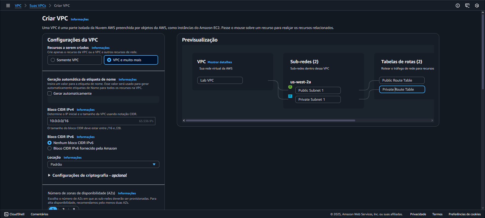
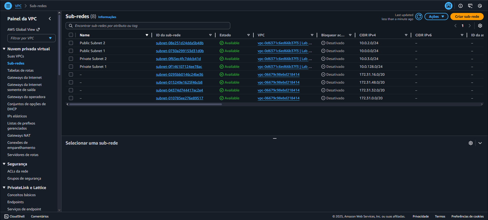
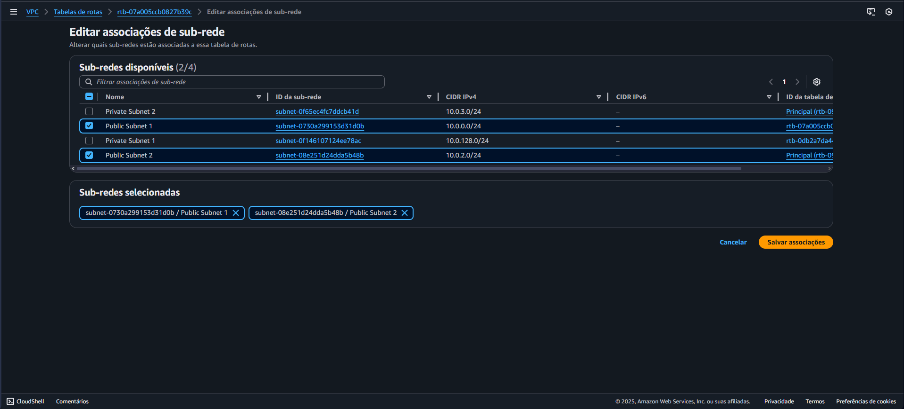
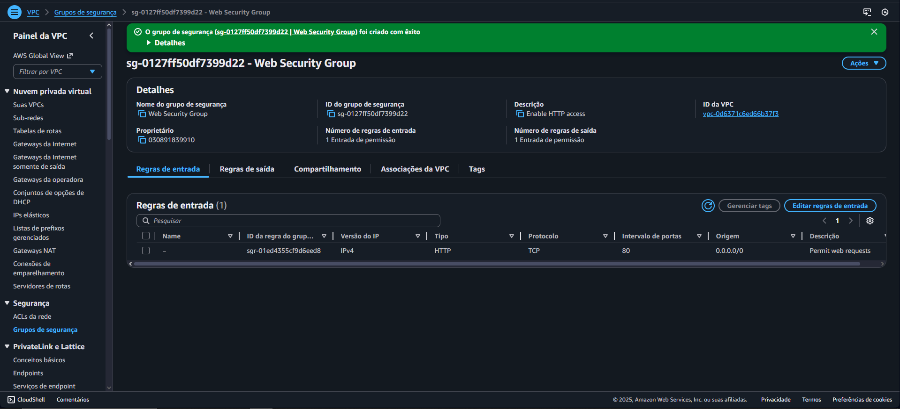
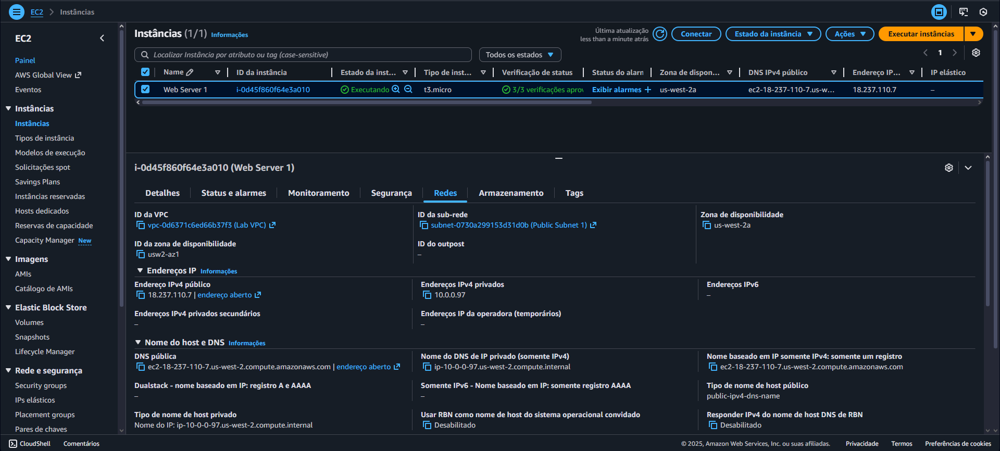

# ☁️ Lab 02 – Criação de VPC e Servidor Web na AWS

  
  
  

## 📘 Visão Geral

Este laboratório teve como objetivo **criar uma Virtual Private Cloud (VPC)** do zero e configurar uma arquitetura completa com **sub-redes, grupo de segurança e uma instância EC2** executando um servidor web.  

A atividade simulou a criação de uma infraestrutura de rede personalizada solicitada por um cliente Fortune 100, demonstrando o processo de planejamento e implementação de componentes essenciais para um ambiente seguro e funcional na AWS.

---

## 🎯 Objetivos do Lab

Ao final deste laboratório, fui capaz de:

- Criar uma **VPC personalizada**  
- Criar **sub-redes públicas e privadas**  
- Configurar um **grupo de segurança** com regras adequadas de entrada e saída  
- Iniciar uma **instância Amazon EC2** dentro da nova VPC  
- **Executar um servidor web** na instância EC2 criada  

---

## ⚙️ O que foi feito neste Lab

1. 🧱 **Criação da VPC**
   - Criei uma **Virtual Private Cloud (VPC)** com faixa de IP customizada (CIDR block).  
   - Nomeei a VPC conforme o cenário do cliente e habilitei a opção de DNS hostnames.  

   

2. 🌐 **Configuração das Sub-redes adicionais**
   - Adicionei **duas sub-redes adicionais**: uma **pública** (com acesso à internet) e uma **privada** (isolada).  
   - As sub-redes foram criadas em **zonas de disponibilidade diferentes** para garantir alta disponibilidade.  

   

3. 🔗 **Internet Gateway e Tabelas de Roteamento**
   - Associei um **Internet Gateway** à VPC para permitir tráfego externo.  
   - Atualizei as **tabelas de rotas** da sub-rede pública para direcionar o tráfego à internet.  

   

4. 🔐 **Criação do Grupo de Segurança**
   - Criei um **Security Group** permitindo tráfego **HTTP (porta 80)** e **SSH (porta 22)** apenas do meu IP.  
   - Associei o grupo à instância EC2 para controlar o tráfego de rede.  

   

5. 🚀 **Inicialização da Instância EC2**
   - Iniciei uma instância **Amazon Linux 2** dentro da sub-rede pública.  
   - Associei o grupo de segurança criado e configurei o **user data** para instalar automaticamente o servidor web (Apache).  

   

6. 🌍 **Teste do Servidor Web**
   - Copiei o **IP público da instância** e testei o acesso via navegador.  
   - O servidor retornou a página padrão do Apache, confirmando a configuração correta.  

   

---

## 💡 Conceitos Aprendidos

- Estrutura e componentes de uma **VPC (Virtual Private Cloud)**  
- Diferença entre **sub-redes públicas e privadas**  
- Importância do **roteamento e gateways** para comunicação externa  
- Função dos **Security Groups** na proteção de instâncias EC2  
- Processo completo de **deploy de um servidor web em ambiente customizado**

---

## 🖥️ Resultado Final

A arquitetura criada replica uma infraestrutura básica de cliente corporativo, composta por:
- Uma **VPC personalizada**
- Sub-redes públicas e privadas
- Um **Internet Gateway** configurado corretamente
- Um **Security Group** restrito
- Uma **instância EC2** funcional rodando um **servidor web Apache**

✅ Toda a estrutura foi testada e validada com sucesso, demonstrando um ambiente seguro, escalável e pronto para futuras implementações.

---

## 🧭 Tecnologias Utilizadas

- **Amazon VPC**  
- **Amazon EC2**  
- **Security Groups**  
- **Internet Gateway**  
- **AWS Management Console**

---

## 🏁 Conclusão

Este laboratório proporcionou uma compreensão prática sobre **como planejar e construir uma rede virtual isolada na AWS**, integrando serviços de rede e computação.  
A experiência consolidou o uso de **VPCs, sub-redes e roteamento**, conectando a teoria à prática e reforçando os fundamentos de arquitetura em nuvem. ☁️🚀
