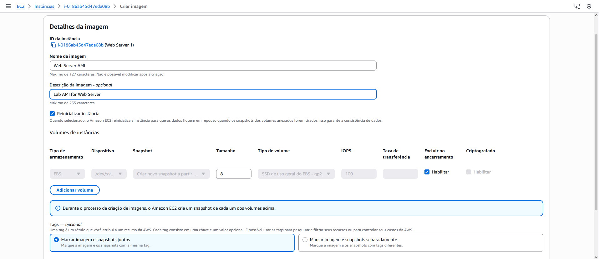
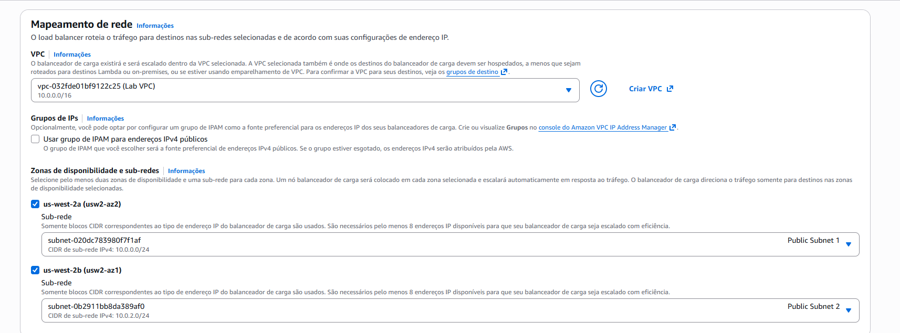
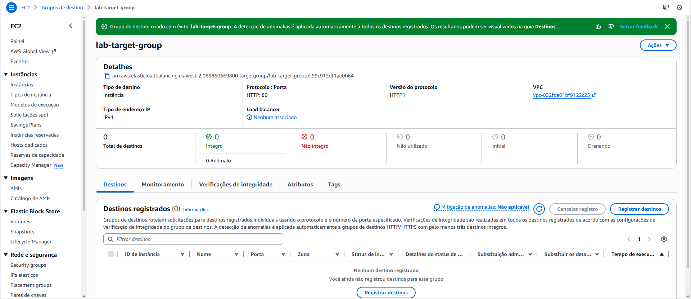
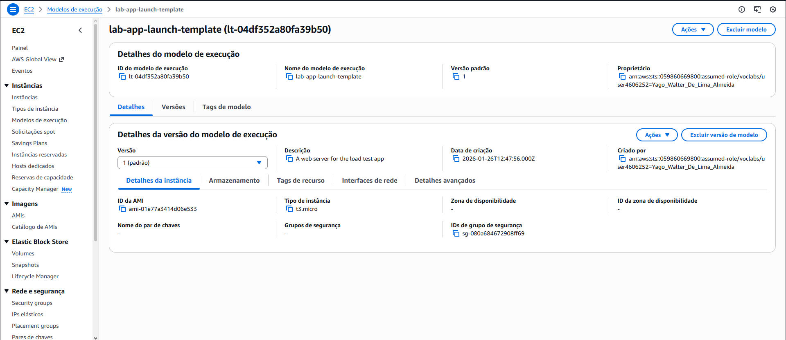
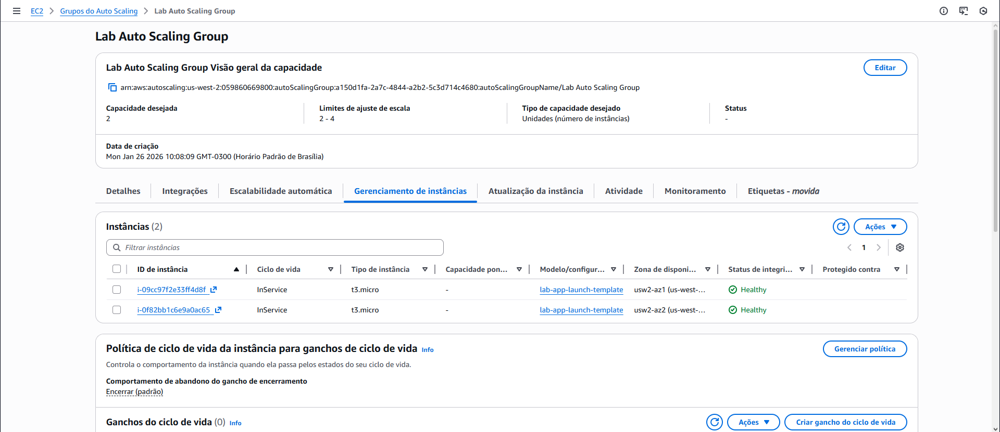
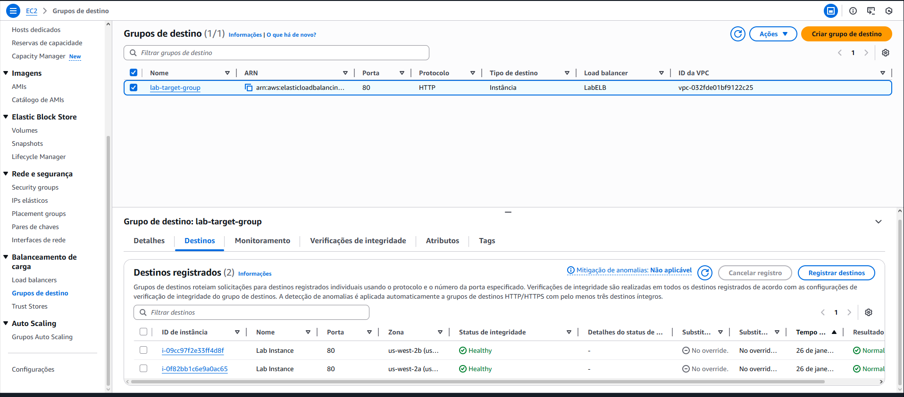
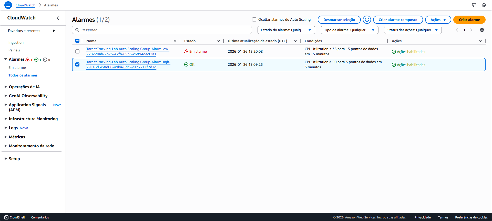
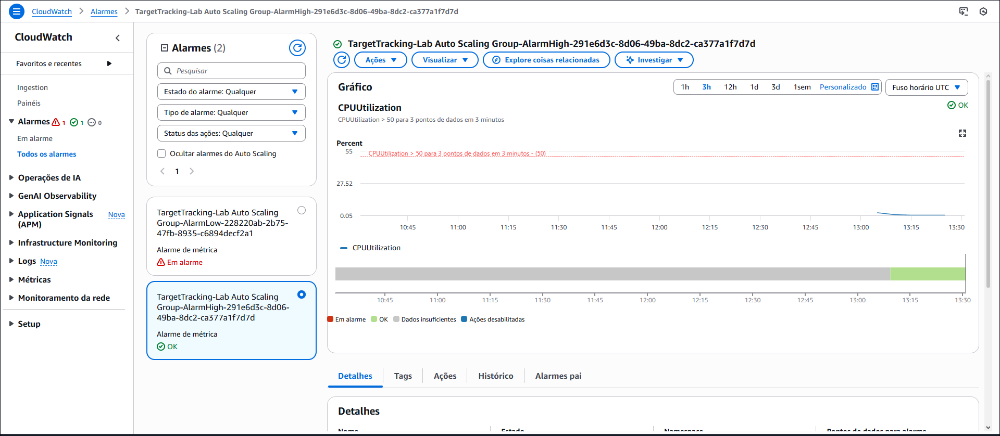

# ⚖️ Lab – Elastic Load Balancing e Auto Scaling

## 📘 Visão Geral

Neste laboratório, utilizei **Elastic Load Balancing (ELB)** e **Amazon EC2 Auto Scaling** para criar uma arquitetura capaz de **balancear carga e escalar automaticamente**, garantindo alta disponibilidade e tolerância a falhas.

A atividade partiu de um único servidor web e evoluiu para uma arquitetura distribuída, com instâncias em **sub-redes privadas**, balanceadas por um **Application Load Balancer** e monitoradas pelo **Amazon CloudWatch**.

---

## 🎯 Objetivos do Laboratório

Ao final do laboratório, foi possível:

- Criar uma **AMI** a partir de uma instância EC2 existente  
- Configurar um **Application Load Balancer (ALB)**  
- Criar um **Launch Template**  
- Criar e configurar um **Auto Scaling Group**  
- Escalar instâncias automaticamente com base na utilização de CPU  
- Monitorar o desempenho com **CloudWatch Alarms**

---

## ⚙️ O que foi feito neste Lab

1. 🧱 **Criação de uma AMI**
   - Criei uma **AMI** a partir da instância existente *Web Server 1*.
   - Essa imagem foi utilizada como base para as novas instâncias do Auto Scaling.

   

2. ⚖️ **Criação do Application Load Balancer**
   - Criei um **Application Load Balancer (ALB)**.
   - Configurei o ALB em **duas Zonas de Disponibilidade**, utilizando sub-redes públicas.
   - Associei o **Security Group da web**, permitindo tráfego HTTP.
   - Criei e associei um **Target Group** para as instâncias EC2.

   
   

3. 📄 **Criação do Launch Template**
   - Criei um **Launch Template** utilizando a AMI criada anteriormente.
   - Defini tipo de instância, grupo de segurança e demais configurações necessárias.
   - Preparei o modelo para uso com o Auto Scaling.

   

4. 🔄 **Criação do Auto Scaling Group**
   - Criei um **Auto Scaling Group** usando o Launch Template.
   - Configurei o grupo para iniciar instâncias em **sub-redes privadas** distribuídas em duas AZs.
   - Defini:
     - Capacidade mínima: 2  
     - Capacidade desejada: 2  
     - Capacidade máxima: 4  

   

5. 🔗 **Integração com Load Balancer**
   - Associei o Auto Scaling Group ao **Target Group do ALB**.
   - Configurei **health checks** baseados no ELB para validar a integridade das instâncias.

   

6. 📈 **Configuração de Alarmes no CloudWatch**
   - Utilizei alarmes do **Amazon CloudWatch** criados automaticamente pelo Auto Scaling.
   - Configurei uma política de escalabilidade baseada em:
     - **Utilização média de CPU**
     - Valor alvo de **50%**
   - Os alarmes controlaram a criação e remoção de instâncias conforme a carga.

   

7. 🧪 **Teste de Escalabilidade**
   - Gereei carga na aplicação para aumentar a utilização de CPU.
   - Observei o Auto Scaling criar novas instâncias automaticamente.
   - Confirmei o balanceamento de tráfego entre as instâncias via ALB.

   

8. 🧹 **Encerramento da Instância Original**
   - Encerrei a instância *Web Server 1*, que foi utilizada apenas para a criação da AMI.
   - A aplicação continuou funcionando normalmente por meio do Auto Scaling Group.

---

## 🧠 Conceitos Aprendidos

- Funcionamento do **Elastic Load Balancing**
- Criação e uso de **AMIs**
- Arquitetura escalável com **Auto Scaling**
- Distribuição de instâncias em **múltiplas AZs**
- Uso de **CloudWatch Alarms** para escalabilidade automática
- Separação entre **sub-redes públicas e privadas**

---

## 🖥️ Resultado Final

Ao final do laboratório, a arquitetura possuía:

- Application Load Balancer distribuindo o tráfego
- Instâncias EC2 em sub-redes privadas
- Auto Scaling ajustando automaticamente a capacidade
- Monitoramento e escalabilidade baseados em métricas reais

✅ A aplicação manteve disponibilidade mesmo sob aumento de carga.

---

## 🧰 Tecnologias Utilizadas

- Amazon EC2  
- Elastic Load Balancing (ALB)  
- EC2 Auto Scaling  
- Amazon CloudWatch  
- Amazon VPC  
- AWS Management Console  

---

## 🏁 Conclusão

Este laboratório demonstrou como combinar **ELB, Auto Scaling e CloudWatch** para criar arquiteturas **altamente disponíveis, escaláveis e resilientes**, fundamentais para aplicações em produção na AWS.
