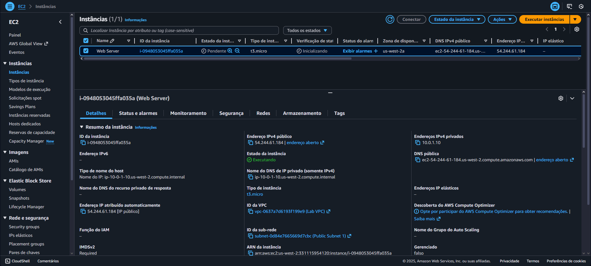
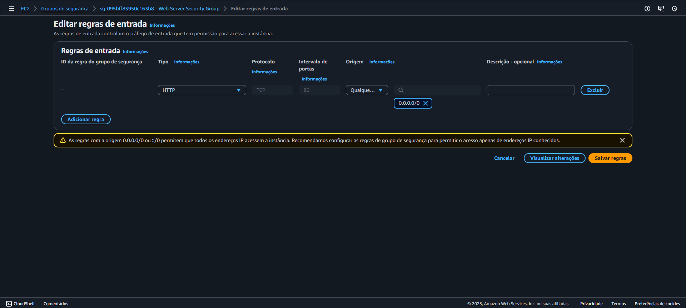
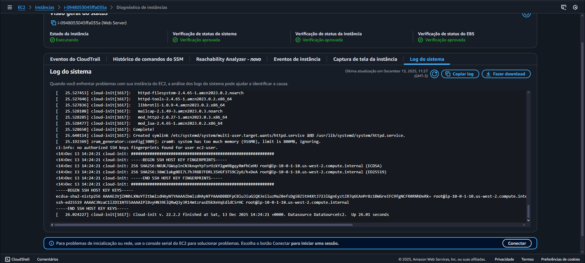
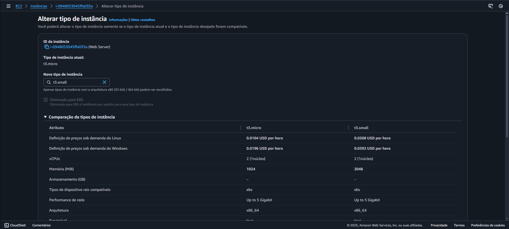
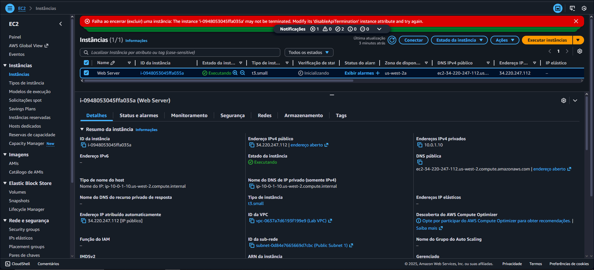
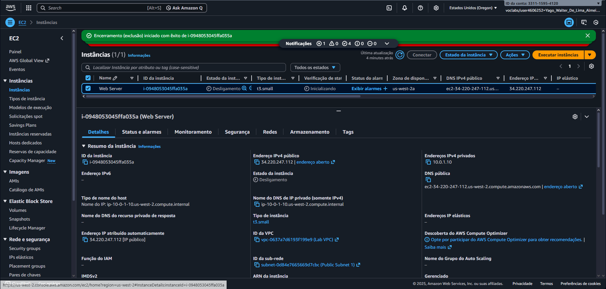

# ☁️ Lab 01 – Amazon EC2: Criação e Gerenciamento de Instâncias

  
  
  

## 📘 Visão Geral

Este laboratório apresenta uma introdução prática ao **Amazon Elastic Compute Cloud (Amazon EC2)** — o serviço da AWS que fornece **capacidade computacional redimensionável na nuvem**.  
O objetivo principal foi entender como **executar, redimensionar, gerenciar e monitorar** uma instância EC2 diretamente pelo console da AWS.  

O Amazon EC2 permite que você inicie servidores virtuais (instâncias) em poucos minutos, oferecendo total controle sobre o ambiente, segurança e escalabilidade conforme a demanda.

---

## ⚙️ O que foi feito neste Lab

Durante o laboratório, realizei as seguintes etapas:

1. 🚀 **Inicialização da Instância EC2**  
   - Escolhi uma AMI (Amazon Machine Image) baseada em Linux.  
   - Configurei o tipo da instância e ativei a **proteção contra encerramento acidental**.  

   

2. 🔐 **Configuração de Segurança**  
   - Ajustei o **grupo de segurança**, liberando a porta **HTTP (80)** para permitir acesso ao servidor web.  

   

3. 🧭 **Monitoramento pelo Console EC2**  
   - Acompanhei o status e logs diretamente pelo botão de **Ações**.  

   

4. 🌐 **Acesso ao Servidor Web**  
   - Copiei o **IP público da instância** e acessei via navegador.  
   - O site carregou corretamente, mostrando a página padrão do servidor web configurado.  

   

5. ⚖️ **Redimensionamento da Instância**  
   - Alterei o tipo da instância e volume para aumentar ou reduzir a capacidade conforme a necessidade.  

    

6. 🧱 **Teste de Proteção contra Encerramento**  
   - Testei a função de proteção para garantir que a instância não fosse encerrada por engano.  

   

7. 🧹 **Finalização Segura**  
   - Após os testes, desativei a proteção e **encerrei a instância** de forma controlada.  

   

---

## 💡 Conceitos Aprendidos

- Entendimento sobre **instâncias EC2** e suas configurações.  
- Importância dos **grupos de segurança** e regras de entrada.  
- Monitoramento básico de instâncias no **console EC2**.  
- Como **redimensionar** uma instância EC2.  
- Boas práticas de segurança e encerramento responsável.  

---

## 🖥️ Resultado Final

Ao concluir o laboratório, a instância EC2 foi **criada, configurada, testada e finalizada com sucesso**, seguindo todas as boas práticas apresentadas.  
O ambiente demonstrou o funcionamento completo de um **servidor web hospedado na AWS**, desde a inicialização até o encerramento seguro dos recursos.

📌 Em resumo:
- Instância EC2 ativa e acessível via navegador  
- Configuração de segurança aplicada corretamente (porta HTTP liberada)  
- Proteção contra encerramento testada com sucesso  
- Encerramento seguro da instância ao final do experimento

---

## 🧭 Tecnologias Utilizadas

- **Amazon EC2**  
- **AWS Management Console**

---

## 🏁 Conclusão

Este laboratório proporcionou uma experiência prática sobre o uso do **Amazon EC2**, desde a criação até o encerramento de uma instância.  
Com isso, foi possível entender na prática conceitos fundamentais de **provisionamento**, **segurança**, **acesso remoto** e **gerenciamento de recursos** na nuvem AWS.  

> Esse aprendizado serve como base para os próximos serviços da AWS, como **S3**, **IAM** e **CloudFront**, que serão explorados nos próximos laboratórios. ☁️🚀
