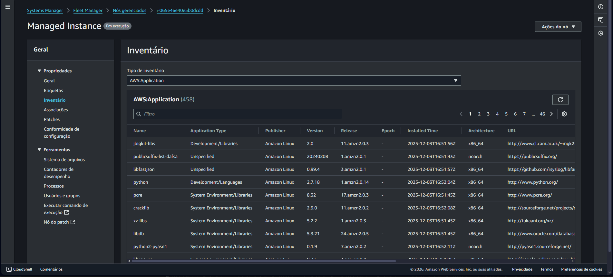
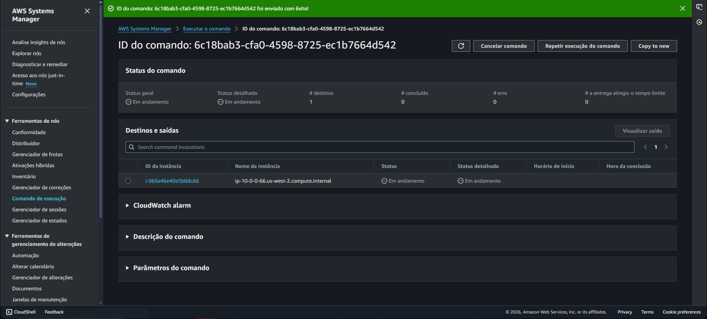
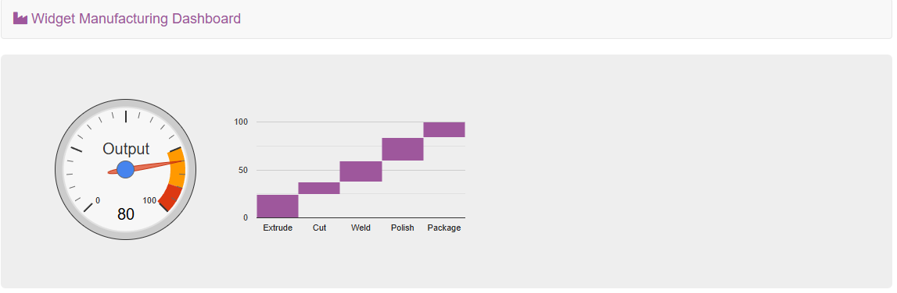
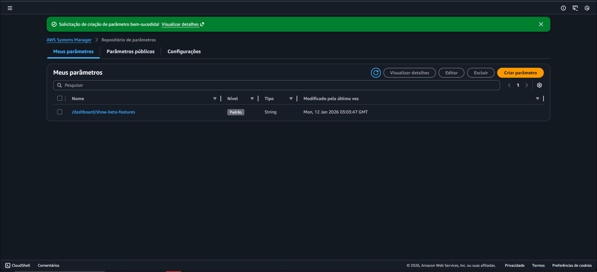
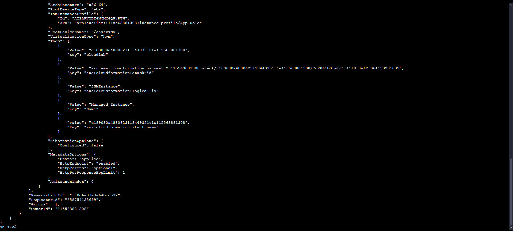

# ⚙️ Lab – AWS Systems Manager

## 📘 Visão Geral

Neste laboratório, utilizei o **AWS Systems Manager** para **gerenciar e operar uma instância EC2 sem depender de acesso via SSH**.  
O foco foi centralizar operações, automatizar tarefas e gerenciar configurações da aplicação de forma segura.

Foram exploradas funcionalidades como **Fleet Manager**, **Run Command**, **Parameter Store** e **Session Manager**.

---

## 🎯 Objetivos do Laboratório

Ao final do laboratório, foi possível:

- Verificar configurações e permissões de instâncias gerenciadas
- Executar comandos remotamente em instâncias EC2
- Instalar e configurar aplicações sem acesso direto via SSH
- Gerenciar parâmetros de aplicação usando o Parameter Store
- Acessar a linha de comando da instância com Session Manager

---

## ⚙️ O que foi feito neste Lab

1. 📋 **Coleta de Inventário com Fleet Manager**
   - Utilizei o **Fleet Manager** para coletar informações da instância EC2.
   - Visualizei dados do sistema operacional, aplicações instaladas e metadados.
   - Validei configurações sem precisar acessar a instância via SSH.

   

2. 🚀 **Instalação de Aplicação com Run Command**
   - Usei o **Run Command** para instalar automaticamente uma aplicação web (Widget Manufacturing Dashboard).
   - O comando executou scripts para instalar:
     - Apache
     - PHP
     - AWS SDK
     - Aplicação web
   - A aplicação foi instalada e iniciada sem login direto na instância.

   

3. 🌐 **Validação da Aplicação Web**
   - Acessei a aplicação pelo **IP público da instância EC2**.
   - Confirmei que o servidor web estava funcionando corretamente após a execução remota do comando.

   

4. 🧩 **Gerenciamento de Configuração com Parameter Store**
   - Criei um parâmetro no **Parameter Store** para habilitar funcionalidades beta da aplicação.
   - A aplicação consultou o parâmetro automaticamente e exibiu novos recursos.
   - Ao remover o parâmetro, a funcionalidade foi desativada.

   

5. 🖥️ **Acesso à Instância com Session Manager**
   - Acessei a instância EC2 utilizando o **Session Manager**.
   - Executei comandos diretamente no terminal via navegador.
   - Validei arquivos da aplicação e consultei dados da instância via AWS CLI.
   - Tudo isso sem abrir portas SSH ou gerenciar chaves.

   

---

## 🧠 Conceitos Aprendidos

- Gerenciamento centralizado de instâncias com **AWS Systems Manager**
- Execução remota de comandos sem SSH
- Uso do **Parameter Store** para controle de configurações de aplicação
- Acesso seguro a instâncias com **Session Manager**
- Automação e operação em escala
- Melhoria de segurança ao evitar portas abertas e chaves SSH

---

## 🖥️ Resultado Final

Ao final do laboratório:

- A instância EC2 estava totalmente gerenciada pelo **AWS Systems Manager**
- A aplicação foi instalada e configurada remotamente
- Parâmetros da aplicação foram controlados dinamicamente
- O acesso à instância foi feito de forma **segura e auditável**, sem SSH

---

## 🧰 Tecnologias Utilizadas

- AWS Systems Manager  
- Amazon EC2  
- Fleet Manager  
- Run Command  
- Parameter Store  
- Session Manager  
- AWS CLI  
- AWS Management Console  

---

## 🏁 Conclusão

Este laboratório demonstrou como o **AWS Systems Manager** simplifica a operação, automação e segurança de instâncias EC2, reduzindo a dependência de acessos manuais e melhorando a governança do ambiente.
